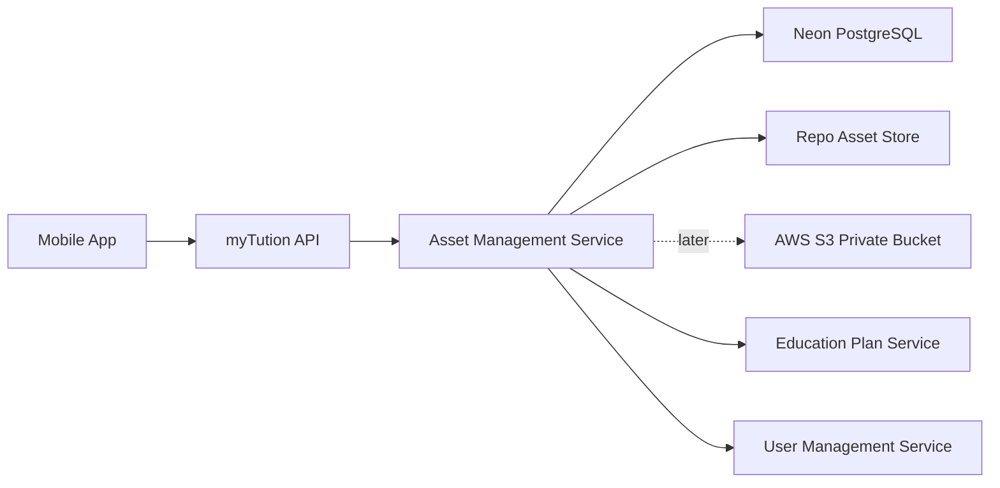

# myTution Asset Management Specification

## 1. Objective

Build an Asset Management Service that stores, governs, and serves private learning assets for myTution.

Assets include:
- Documents: PDF notes, worksheets, cheat sheets, answer keys.
- Videos: concept videos, class recordings, explainers.
- Articles: rich educational material and diagrams.
- Interactions: flashcards, quizzes, questionnaires, surveys, to-do tasks.
- User uploads later: tutor certificates, avatars, homework submissions, attachments.

All private assets must be accessible only after authentication and authorization. The mobile app must never receive permanent storage credentials or public bucket URLs for protected content.

## 2. Recommended Storage Strategy

Recommended provider for MVP: repo-backed AMS storage.

Reasons:
- No external storage account is required for the first implementation.
- Curated learning content can live in the monorepo, versioned with code.
- AMS APIs, auth checks, metadata, access logs, and Education Plan integration can be tested now.
- The mobile app still talks only to AMS, so migration to AWS S3 later does not require a mobile app rewrite.
- Mock/demo content remains easy to review in pull requests.

Production target: AWS S3 + CloudFront signed URLs/cookies.

Decision:
- Use a repo-backed `StorageProvider` now.
- Keep the Asset Management Service provider-agnostic through an internal `StorageProvider` interface.
- Add AWS S3 provider later behind the same interface.

Important constraint:
- Repo-backed storage must be treated as read-only at runtime.
- It is suitable for seeded/curated MVP content, not for user uploads.
- Tutor/user uploads, large videos, and production documents should move to S3/R2-style object storage.

## 3. Architecture



Asset access pattern:
1. App calls myTution API with bearer token.
2. API validates user and role.
3. Asset service validates access against profile, role, program, milestone, batch, or admin permission.
4. Asset service returns either:
   - asset metadata for JSON-native content, or
   - a short-lived private URL for binary content.
5. App fetches the content using the short-lived URL or renders the structured JSON.

## 4. Asset Types

### Binary assets

Stored in the repo for MVP curated content, then migrated to object storage later.

Examples:
- PDF
- Image
- Video
- Audio
- ZIP/package
- Thumbnail

### Structured assets

Stored in PostgreSQL as JSON with optional linked media assets.

Examples:
- Article body
- Flashcard deck
- Quiz questions
- Survey questions
- Questionnaire schema
- To-do task details

Rationale:
- Binary content belongs in object storage.
- Interactive learning content must be queryable, versioned, auditable, and editable without app rebuilds.

## 5. Repo Asset Store Design

Recommended repo path:

```txt
services/api/assets/
```

Directory convention:

```txt
services/api/assets/{env}/{assetType}/{ownerType}/{ownerId}/{assetId}/v{version}/{filename}
```

Examples:

```txt
services/api/assets/mock/video/program/neet-foundation/asset_kinematics_intro/v1/kinematics-intro.mp4
services/api/assets/mock/document/program/neet-foundation/asset_formula_sheet/v1/formula-sheet.pdf
services/api/assets/mock/image/program/neet-foundation/asset_kinematics_cover/v1/cover.png
services/api/assets/mock/json/program/neet-foundation/asset_flashcards_motion/v1/content.json
```

Repo-backed content rules:
- Store small curated assets only.
- Store structured articles, flashcards, quizzes, surveys, questionnaires, and tasks as JSON files or DB `contentJson`.
- Keep large videos out of Git when they become heavy; use short demo clips only in MVP.
- Use Git LFS only if absolutely needed, but prefer S3 migration before video files become large.
- Do not write new uploaded files into the repo at runtime.
- All asset records still live in Neon/Postgres, with `objectKey` pointing to a repo-relative path.

AMS read behavior for repo provider:
1. Validate bearer token.
2. Validate access against role/profile/program/milestone/batch.
3. Resolve `objectKey` to a file inside the allowed repo asset root.
4. Reject path traversal and unknown MIME types.
5. Return the file through an authenticated AMS endpoint, or return structured JSON.
6. Log the access event.

For MVP, the AMS can return an authenticated API URL instead of a presigned storage URL:

```txt
GET /api/v1/assets/{assetId}/content?token=short_lived_asset_token
```

The token is issued only after normal auth checks and expires quickly.

## 6. Future Bucket Design

Bucket name:
- `mytution-assets-prod`
- `mytution-assets-staging`
- `mytution-assets-dev`

Object key convention:

```txt
env/{assetType}/{ownerType}/{ownerId}/{yyyy}/{mm}/{assetId}/{version}/{filename}
```

Examples:

```txt
prod/video/program/program_123/2026/07/asset_abc/v1/kinematics-intro.mp4
prod/document/program/program_123/2026/07/asset_def/v1/neet-cheatsheet.pdf
prod/thumbnail/program/program_123/2026/07/asset_ghi/v1/cover.png
prod/upload/user/user_123/2026/07/asset_jkl/v1/homework.pdf
```

Future bucket policy:
- No public read.
- No public write.
- Only server-side credentials can sign URLs.
- App upload/download must use presigned URLs issued by Asset Management Service.

## 7. Service Responsibilities

Asset Management Service owns:
- Asset metadata.
- Asset upload sessions.
- Asset versions.
- Asset lifecycle status.
- Signed upload URL generation when an object-storage provider is enabled.
- Authenticated repo content URL generation when the repo provider is enabled.
- Signed download/read URL generation when an object-storage provider is enabled.
- Access-control checks.
- Virus scan status tracking.
- Processing status for video thumbnails/transcoding later.
- Audit logs for asset access.

It does not own:
- Program milestone business logic.
- User profile identity.
- Payment entitlements.
- Chat/community thread business logic.

Those services may reference assets by `assetId`.

## 8. Access Model

Access is granted by explicit asset visibility and linkage.

Visibility options:
- `private`: owner/admin only.
- `program`: users enrolled in linked program.
- `milestone`: users with unlocked milestone.
- `batch`: users enrolled in batch.
- `role`: all users with allowed role.
- `admin`: admin-only.

Access rules:
- Student can read a program asset only if the student has selected/enrolled in the program.
- Student can read milestone assets only if the milestone is unlocked.
- Tutor can read and upload assets for batches/programs they own or are assigned to.
- Parent can read assets tied to linked child dashboards, if allowed by content policy.
- Admin can create, update, archive, and inspect all assets.
- Signed URLs or repo content tokens must be short-lived.
- Signed URLs and repo content tokens are bearer tokens and must never be logged in full.

Suggested URL TTL:
- Repo content token: 2-5 minutes.
- Upload URL: 10 minutes when object storage is enabled.
- Download URL for documents/images: 5 minutes when object storage is enabled.
- Video playback segment URL: 5-15 minutes when object storage is enabled.
- Admin preview URL: 2 minutes.

## 9. Database Model

### Asset

| Field | Type | Notes |
|---|---|---|
| id | uuid | Primary key |
| assetType | enum | document, video, article, flashcard, quiz, survey, questionnaire, todo, thumbnail, upload |
| storageType | enum | repo, object, json, external |
| title | text | Display title |
| description | text nullable | Display description |
| status | enum | draft, uploading, processing, active, archived, deleted, failed |
| visibility | enum | private, program, milestone, batch, role, admin |
| ownerType | enum | system, admin, tutor, user, program, batch |
| ownerId | text nullable | Depends on ownerType |
| currentVersionId | uuid nullable | FK AssetVersion |
| contentJson | jsonb nullable | Articles, flashcards, quizzes, surveys, todos |
| thumbnailAssetId | uuid nullable | FK Asset |
| durationSeconds | int nullable | Video/audio |
| mimeType | text nullable | Main MIME |
| tags | text[] | Search/filter |
| sourceTag | text nullable | mock, admin, import, user_upload |
| createdByUserId | uuid nullable | FK User |
| updatedByUserId | uuid nullable | FK User |
| createdAt | timestamptz | |
| updatedAt | timestamptz | |

### AssetVersion

| Field | Type | Notes |
|---|---|---|
| id | uuid | Primary key |
| assetId | uuid | FK Asset |
| versionNumber | int | Starts at 1 |
| objectKey | text nullable | Repo-relative path now; S3 key later |
| fileName | text nullable | Original filename |
| fileSizeBytes | bigint nullable | |
| checksumSha256 | text nullable | |
| mimeType | text nullable | |
| status | enum | pending_upload, uploaded, scan_pending, clean, infected, processing, active, failed |
| metadataJson | jsonb nullable | dimensions, pages, transcoding output, etc. |
| createdAt | timestamptz | |

### AssetLink

Connects assets to programs, milestones, modules, batches, users, or activities.

| Field | Type | Notes |
|---|---|---|
| id | uuid | Primary key |
| assetId | uuid | FK Asset |
| entityType | enum | program, module, milestone, activity, batch, user, profile |
| entityId | text | Target entity ID |
| usageType | enum | primary_content, supporting_content, thumbnail, attachment, answer_key, certificate |
| required | boolean | For program progress |
| sortOrder | int | |
| createdAt | timestamptz | |

### AssetAccessLog

| Field | Type | Notes |
|---|---|---|
| id | uuid | Primary key |
| assetId | uuid | FK Asset |
| userId | uuid | FK User |
| action | enum | view_metadata, create_upload_url, complete_upload, create_download_url, archive, delete |
| result | enum | allowed, denied, failed |
| reason | text nullable | |
| ipAddress | text nullable | |
| userAgent | text nullable | |
| createdAt | timestamptz | |

### UploadSession

| Field | Type | Notes |
|---|---|---|
| id | uuid | Primary key |
| assetId | uuid | FK Asset |
| assetVersionId | uuid | FK AssetVersion |
| requestedByUserId | uuid | FK User |
| objectKey | text | Repo-relative path now; S3 key later |
| status | enum | created, uploaded, completed, expired, failed |
| expiresAt | timestamptz | |
| createdAt | timestamptz | |
| completedAt | timestamptz nullable | |

## 10. API Specification

Base path:

```txt
/api/v1/assets
```

### POST `/assets`

Create asset metadata.

Request:

```json
{
  "assetType": "video",
  "storageType": "object",
  "title": "Kinematics introduction",
  "description": "Short concept video for Class 11 medical foundation",
  "visibility": "milestone",
  "ownerType": "program",
  "ownerId": "program_123",
  "tags": ["physics", "kinematics", "neet"],
  "sourceTag": "admin"
}
```

Response:

```json
{
  "data": {
    "assetId": "asset_123",
    "status": "draft"
  }
}
```

### POST `/assets/{assetId}/upload-url`

Create a private upload URL for binary assets.

MVP note:
- This endpoint should return `501 NOT_IMPLEMENTED` for repo-backed runtime uploads.
- Curated repo assets are added through seed/import scripts.
- Enable this endpoint when S3/R2 provider is configured.

Request:

```json
{
  "fileName": "kinematics-intro.mp4",
  "mimeType": "video/mp4",
  "fileSizeBytes": 52428800,
  "checksumSha256": "optional_client_checksum"
}
```

Response:

```json
{
  "data": {
    "uploadSessionId": "upload_123",
    "assetVersionId": "version_123",
    "method": "PUT",
    "uploadUrl": "https://signed-private-url",
    "requiredHeaders": {
      "Content-Type": "video/mp4"
    },
    "expiresAt": "2026-07-02T10:10:00Z"
  }
}
```

### POST `/assets/upload-sessions/{uploadSessionId}/complete`

Mark upload complete after client uploads to object storage.

Request:

```json
{
  "uploaded": true,
  "checksumSha256": "optional_client_checksum"
}
```

Response:

```json
{
  "data": {
    "assetId": "asset_123",
    "status": "processing"
  }
}
```

### GET `/assets/{assetId}`

Returns metadata and, if authorized, structured content.

Response for article:

```json
{
  "data": {
    "id": "asset_article_123",
    "assetType": "article",
    "title": "Blood Sugar Basics",
    "contentJson": {
      "subtitle": "Monitoring your blood sugar levels",
      "body": []
    }
  }
}
```

### POST `/assets/{assetId}/read-url`

Create a short-lived private read URL for binary content.

For repo-backed MVP, this returns an AMS-hosted content URL rather than a storage-provider URL.

Request:

```json
{
  "purpose": "playback"
}
```

Response:

```json
{
  "data": {
    "assetId": "asset_123",
    "method": "GET",
    "readUrl": "https://api.mytution.com/api/v1/assets/asset_123/content?token=short_lived_asset_token",
    "expiresAt": "2026-07-02T10:05:00Z"
  }
}
```

### GET `/assets/{assetId}/content`

Streams repo-backed or object-backed binary content after validating the short-lived asset token.

Query:
- `token`: short-lived token issued by `/assets/{assetId}/read-url`.

Response:
- Binary stream with correct `Content-Type`.
- `403` if token is invalid or expired.
- `404` if asset is missing or archived.

### POST `/assets/{assetId}/links`

Attach asset to a program, module, milestone, activity, batch, or user.

Request:

```json
{
  "entityType": "activity",
  "entityId": "activity_123",
  "usageType": "primary_content",
  "required": true,
  "sortOrder": 1
}
```

### GET `/assets`

List assets for admin/content management.

Query filters:
- `assetType`
- `status`
- `visibility`
- `ownerType`
- `ownerId`
- `tag`
- `sourceTag`
- `cursor`

### PATCH `/assets/{assetId}`

Update metadata, visibility, status, content JSON, thumbnail, or tags.

### DELETE `/assets/{assetId}`

Soft delete asset. Hard delete object storage only via admin cleanup job.

## 11. Content JSON Formats

### Article

```json
{
  "subtitle": "Monitoring your blood sugar levels",
  "estimatedReadMinutes": 4,
  "blocks": [
    { "type": "paragraph", "text": "..." },
    { "type": "heading", "text": "Key points" },
    { "type": "bulletList", "items": ["...", "..."] },
    { "type": "image", "assetId": "asset_image_123", "alt": "Diagram" }
  ]
}
```

### Flashcards

```json
{
  "cards": [
    {
      "question": "What is the primary source of energy for the brain?",
      "answer": "Glucose",
      "learnMoreAssetId": "asset_article_123"
    }
  ]
}
```

### Quiz

```json
{
  "questions": [
    {
      "prompt": "Which topic checks conceptual clarity?",
      "options": [
        { "id": "a", "text": "Diagnostic Quiz" },
        { "id": "b", "text": "Payment Setup" }
      ],
      "correctOptionId": "a",
      "explanation": "A diagnostic quiz assesses conceptual understanding.",
      "learnMoreAssetId": "asset_article_123"
    }
  ],
  "scoring": {
    "passingPercent": 70
  }
}
```

## 12. Education Plan Integration

Current education activity records should reference assets.

Recommended relationship:
- `EducationContent` becomes content metadata or maps to `Asset`.
- `MilestoneActivity` references `assetId`.
- `ActivityProgress` remains per user/profile/program/activity.

When activity is opened:
1. App calls Education Plan API for milestone activities.
2. Each activity includes `assetId`, `assetType`, title, completion status, required/supporting flag.
3. App opens asset screen.
4. Asset screen calls Asset API to fetch JSON or read URL.
5. User taps Mark Complete.
6. Education Plan API marks `ActivityProgress` complete.

## 13. Repo-Backed Import Flow

Admin/developer curated content flow:
1. Add binary files or JSON files under `services/api/assets/mock/...`.
2. Add or update a seed/import manifest.
3. Run seed/import script.
4. Script creates `Asset`, `AssetVersion`, and `AssetLink` records.
5. Activity records reference `assetId`.
6. Mobile app fetches content only through AMS.

Example manifest:

```json
{
  "assets": [
    {
      "assetId": "asset_kinematics_intro",
      "assetType": "video",
      "storageType": "repo",
      "title": "Kinematics introduction",
      "visibility": "milestone",
      "objectKey": "mock/video/program/neet-foundation/asset_kinematics_intro/v1/kinematics-intro.mp4",
      "mimeType": "video/mp4",
      "sourceTag": "mock"
    },
    {
      "assetId": "asset_motion_flashcards",
      "assetType": "flashcard",
      "storageType": "json",
      "title": "Motion flashcards",
      "contentJsonPath": "mock/json/program/neet-foundation/asset_motion_flashcards/v1/content.json",
      "sourceTag": "mock"
    }
  ]
}
```

## 14. Future Upload Flow

Admin/tutor upload flow:
1. Create asset metadata.
2. Request upload URL.
3. Upload binary directly to S3/R2 using PUT.
4. Complete upload session.
5. Backend verifies object exists.
6. Backend sets status to `scan_pending` or `processing`.
7. After scan/processing, status becomes `active`.
8. Asset can now be linked to program/milestone/activity.

Mobile app must never proxy large production files through Render API.

## 15. Security Controls

Required:
- Repo asset root allowlist for MVP.
- Path traversal protection.
- Short-lived repo content tokens.
- Private bucket only when object storage is enabled.
- Short-lived presigned URLs when object storage is enabled.
- Server-side access-control check before URL issuance.
- Never log signed URLs or repo content tokens in full.
- Store only object keys in DB, not permanent public URLs.
- Validate MIME type and size before upload URL is issued.
- Enforce maximum upload sizes by asset type.
- Maintain access logs.
- Soft delete first, lifecycle hard delete later.
- Tag mock/test assets with `sourceTag = mock`.

Recommended next:
- Virus scanning for user-uploaded documents.
- Video transcoding pipeline for adaptive playback.
- Watermarking for premium content.
- Content moderation for user uploads.
- Signed URL invalidation strategy via very short TTL.

## 16. Environment Variables

Render API:

```txt
ASSET_STORAGE_PROVIDER=repo
ASSET_REPO_ROOT=services/api/assets
ASSET_CONTENT_TOKEN_TTL_SECONDS=300

# Future S3/R2 settings
R2_ACCOUNT_ID=
R2_ACCESS_KEY_ID=
R2_SECRET_ACCESS_KEY=
R2_BUCKET_NAME=mytution-assets-prod
R2_PUBLIC_BASE_URL=
ASSET_SIGNED_URL_TTL_SECONDS=300
ASSET_UPLOAD_URL_TTL_SECONDS=600
ASSET_MAX_DOCUMENT_MB=25
ASSET_MAX_VIDEO_MB=500
```

Do not expose these variables to Expo/mobile.

## 17. Implementation Plan

### Phase 1: Foundation

- Add Prisma models: `Asset`, `AssetVersion`, `AssetLink`, `UploadSession`, `AssetAccessLog`.
- Add shared types for asset DTOs.
- Add `StorageProvider` interface.
- Implement repo-backed provider.
- Add seed/import manifest for repo assets.
- Add get metadata, read URL, and content streaming APIs.
- Keep upload URL and complete upload APIs behind provider capability checks.
- Add admin-only authorization guard for create/update/delete.

### Phase 2: Education Content Integration

- Link milestone activities to `assetId`.
- Move articles, flashcards, and quizzes into `Asset.contentJson`.
- Keep mock seed data tagged `mock`.
- Update Education Plan API responses to include asset references.
- Update mobile resource screens to fetch from Asset API.

### Phase 3: Admin Content Operations

- Add admin endpoints for list/filter/update/archive assets.
- Add asset linking UI later.
- Add bulk import seed script for program content.
- Add validation schemas for article/flashcard/quiz JSON.

### Phase 4: Hardening

- Add AWS S3 provider behind the same `StorageProvider` interface.
- Add migration script to copy repo asset files to S3 and update `objectKey`.
- Add upload verification using object HEAD.
- Add access logs.
- Add rate limits for URL issuance.
- Add video processing hooks.
- Add virus scan hooks for documents.
- Add object lifecycle policies.

## 18. Migration Path To AWS S3

The mobile app should not change during migration.

Migration steps:
1. Create private S3 bucket.
2. Configure IAM policy for AMS only.
3. Implement `S3StorageProvider`.
4. Run asset migration script:
   - Read active `AssetVersion` rows with `storageType = repo`.
   - Upload matching repo files to S3.
   - Create new `AssetVersion` rows with `storageType = object`.
   - Update `Asset.currentVersionId`.
5. Switch `ASSET_STORAGE_PROVIDER=s3`.
6. Keep repo provider enabled only for fallback until verified.
7. Remove large repo assets from Git after production verification.

## 19. Open Decisions

- How large can repo-backed demo videos be before we move videos to S3?
- Should tutors be allowed to upload class-specific documents in MVP?
- Should parent accounts be able to view all child assets or only summary/report assets?
- What is the max video size we want to allow before transcoding exists?
- Do we need offline downloads in the mobile app? If yes, local encryption and expiration rules are required.

## 20. Near-Term Recommendation

Start with:
- Repo-backed AMS provider for curated MVP content.
- Authenticated AMS content URLs for document/video/image access.
- JSON-backed articles, flashcards, and quizzes in PostgreSQL.
- Asset links from milestones/activities.
- Authenticated URL generation only through myTution API.
- Keep AWS S3 as the planned production provider behind the same interface.

This gives myTution a production-shaped asset layer now, while keeping the first implementation small enough to ship in the current monorepo.
